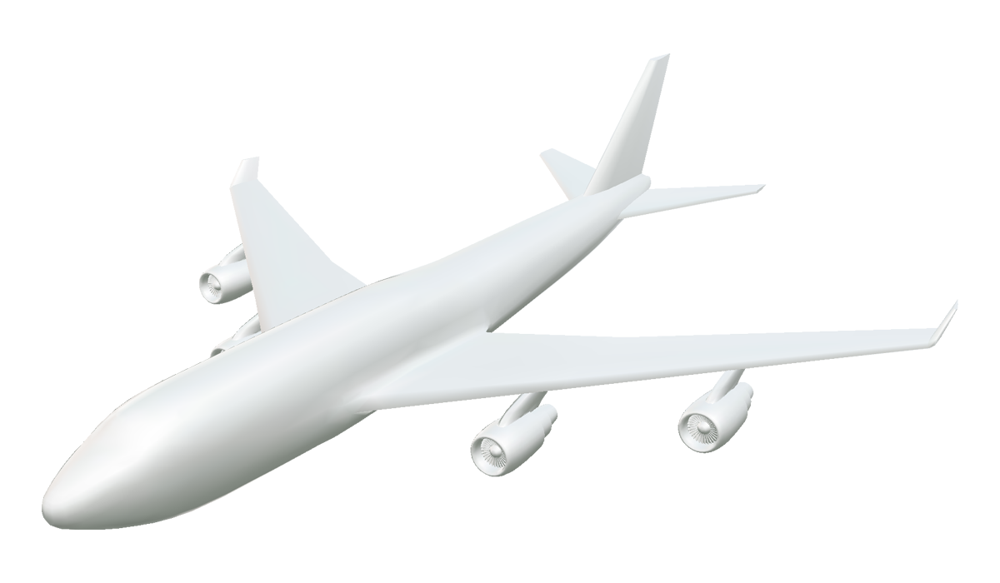

# 747-model

  

- Made using [wings3d](http://www.wings3d.com/) 🔧
- Normals + UV-mapped (poorly) 🤷‍♂️
- .obj + simplicial complex 📚
- Eyeballed at best 🙄
- Not optimized LOL 💥
- 108kb gzipped 🐘

## License

&copy; 2017 Ricky Reusser. This work is licensed under a <a rel="license" href="http://creativecommons.org/licenses/by/4.0/">Creative Commons Attribution 4.0 International License</a>.

